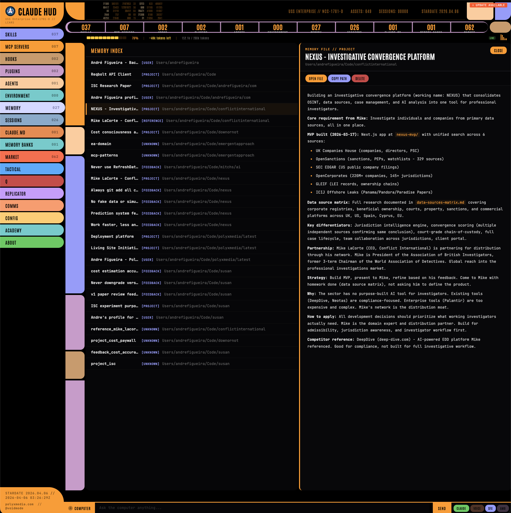
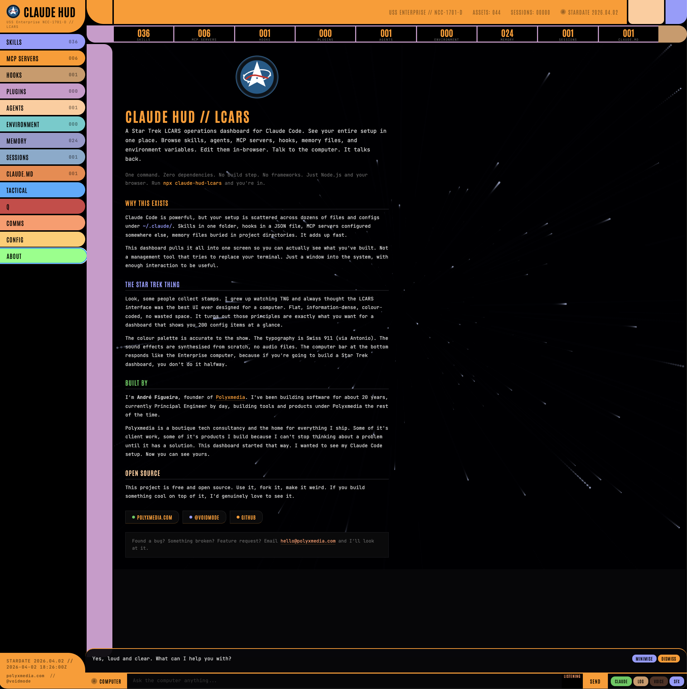

# claude-hud-lcars

<p align="center">
  
</p>

<p align="center">
  <strong>LCARS Operations Dashboard for Claude Code</strong><br>
  <em>United Federation of Developers</em>
</p>

---

<p align="center">
  
</p>

<p align="center">
  
</p>

---

Your entire Claude Code setup, rendered as a Star Trek LCARS terminal. Skills, agents, hooks, MCP servers, plugins, memory files, environment variables, all of it visible, searchable, and actionable from one interface. Click anything to read the full content like you're pulling up a file on a PADD.

There's also a built-in AI chat that responds as the Federation LCARS computer. With voice output. And sound effects. Because if you're going to build an operations dashboard for an AI coding tool, you might as well commit to the bit.

## Quick start

```bash
# Generate dashboard and open in browser
npx claude-hud-lcars

# Live mode with AI chat, voice, and file editing
ANTHROPIC_API_KEY=sk-ant-... npx claude-hud-lcars --serve

# Generate without opening
npx claude-hud-lcars --no-open

# Install globally
npm install -g claude-hud-lcars
```

Zero dependencies. Scans `~/.claude/`, generates a self-contained HTML dashboard, opens it in your browser.

## What you're looking at

The dashboard reads everything Claude Code knows about your setup and presents it in an LCARS interface with the authentic TNG color palette, the signature rounded elbows connecting sections, colored navigation bars, and the Antonio typeface standing in for Swiss 911.

Sections, each one clickable:

- **Skills** with version, execution context (fork/inline), and the full SKILL.md rendered with syntax highlighting when you click through
- **MCP Servers** showing every configured server from `settings.json` and project-level `.mcp.json` files. Scans `~/Code`, `~/Projects`, `~/Developer`, `~/src` and more by default. Set `CLAUDE_HUD_DIRS` for custom paths. Command, args, server type, and full JSON config on drill-down (env vars auto-redacted)
- **Hooks** with event type, matcher pattern, hook type, and the full hook definition viewable in the detail panel
- **Plugins** and their active/inactive status, clickable for config details
- **Agents** with their descriptions and full prompt definitions
- **Environment** variables you've set in settings.json, clickable to copy values
- **Memory** files across all your projects, each one readable in full
- **Sessions** your recent Claude Code sessions with stats: total count, today's sessions, projects used, most active project. Click any session to see the full details
- **CLAUDE.md** every CLAUDE.md file across your setup. Global and per-project. View the full content, open in your editor, or copy the path
- **Tactical** an interactive force-directed graph showing your entire setup as a Star Trek sensor display. Drag nodes around, hover for detailed info cards, click to navigate. Sub-tabs for the systems map and a 3D Enterprise-D model
- **Q** talk to Q from the Continuum. He'll roast your setup, call you "mon capitaine", and appear uninvited every few minutes
- **Comms** scrollable log of all chat messages with full markdown rendering
- **Config** model selector (Haiku/Sonnet/Opus), voice engine, ElevenLabs setup, ship name, ship theme, sound effects
- **About** what this is, who built it, links

Every row is clickable. The detail panel slides open on the right, renders the markdown properly with headers, tables, code blocks, lists, the works. JSON configs get syntax highlighted automatically with color-coded keys, strings, numbers, and booleans. It genuinely looks like you're reading a classified Starfleet briefing.

## Search

Hit `Cmd+K` (or `Ctrl+K`, or `/`) from any screen to open universal search. It searches across everything: skills, hooks, MCP servers, agents, memory files, sessions, CLAUDE.md content, environment variables, plugins. Results are colour-coded by type with match highlighting. Click a result to jump straight to that item in its section. `Escape` to close, `Enter` to open the first result.

## The COMPUTER bar

There's a persistent input bar at the bottom of every screen labeled COMPUTER. Type anything, hit Enter. It talks to the Claude API and streams responses in real-time through a response overlay that slides up from the bottom. The conversation also logs to the COMMS section in the sidebar so you can scroll back through it.

The system prompt makes Claude respond as LCARS, the Library Computer Access and Retrieval System. Calm, measured, structured responses using Starfleet terminology. It refers to your development environment as the ship's systems, your skills as installed modules, your MCP servers as the fleet. It's genuinely fun to use.

This requires the live server mode and an API key:

```bash
export ANTHROPIC_API_KEY=sk-ant-...
npx claude-hud-lcars --serve
```

That starts a local server at `http://localhost:3200`. The dashboard regenerates on every page load so it's always fresh, the chat proxies through to the Anthropic Messages API with streaming, and file operations work for opening and editing your Claude Code configs directly from the browser.

Without an API key, the dashboard still works perfectly for browsing your setup. The COMPUTER bar just shows an offline message.

## Actions

The detail panel includes action buttons that actually do things:

| Button | What happens |
|--------|-------------|
| **INVOKE** | Copies `/skill-name` to your clipboard, paste it straight into Claude Code |
| **OPEN FILE** | Opens the file in your default editor (live mode), or copies the path |
| **COPY PATH** | Copies the full file path |
| **COPY CONFIG** | Copies the complete JSON configuration |
| **EDIT SETTINGS** | Opens settings.json in your editor |
| **DELETE** | Copies the delete command with a confirmation dialog first |

In static mode these copy to clipboard. In live server mode, OPEN FILE actually opens the file.

## Voice and sound

Two toggle buttons in the COMPUTER bar:

**VOICE** activates voice output. Two engines available:

- **Browser (free)** uses Web Speech API. On macOS it picks Samantha by default with pitch and rate tuned for a computer-like delivery.
- **ElevenLabs (premium)** uses the ElevenLabs API for realistic AI voices. Configure your API key in the CONFIG panel and browse all your available voices with live audio previews before selecting one. No credits spent on previews.

**SFX** enables LCARS sound effects on every interaction. Navigation clicks, detail panel opens, sending messages, receiving responses, all get synthesized beeps via the Web Audio API. No sound files, no external assets, just sine wave oscillators tuned to the right frequencies.

**LOG** shows/hides the last computer response. Responses persist after the stream ends. You can minimise the response panel to a slim bar, expand it again, or dismiss it entirely.

All toggleable at any time. SFX is on by default, voice is off.

## Star Trek features

**Boot sequence** on every load. Starfleet logo, ship name, seven subsystems coming online with ascending beeps, progress bar, "ALL SYSTEMS NOMINAL".

**Red Alert / Yellow Alert / Condition Green** based on system health. Offline MCP servers trigger RED ALERT with flashing red border and klaxon. Missing configs trigger YELLOW ALERT.

**Ship naming.** Name your workstation in CONFIG. "USS Enterprise", "USS Defiant", whatever. Shows in the header bar and boot sequence.

**Ship themes.** Four color palettes: Enterprise-D (classic TNG), Defiant (dark red/grey), Voyager (blue-shifted), Discovery (silver/blue). Instant CSS variable swap.

**Bridge viewscreen.** The About tab has a warp-speed starfield canvas as the background. Content floats over the stars.

**3D Enterprise-D.** The Tactical tab has an ENTERPRISE button that loads a real interactive 3D model via Sketchfab.

**Q encounters.** Random chance every 2 minutes that Q appears with a quip. Red popup, snap sound, then he vanishes.

## CLI options

```
Usage: claude-hud-lcars [options]

Options:
  --serve, -s    Start live server with chat, voice, and file editing
  --no-open      Generate dashboard without opening in browser
  --help, -h     Show help

Environment:
  ANTHROPIC_API_KEY    Required for chat (live mode)
  ELEVENLABS_API_KEY   Optional premium voice
  PORT                 Server port (default: 3200)
```

## Configuration

| Variable | Default | What it does |
|----------|---------|-------------|
| `ANTHROPIC_API_KEY` | (none) | Required for COMPUTER bar chat. Get one from [console.anthropic.com](https://console.anthropic.com/) |
| `CLAUDE_MODEL` | `claude-haiku-4-5-20251001` | Which model the COMPUTER bar talks to (also configurable in the CONFIG panel) |
| `PORT` | `3200` | Server port for live mode |
| `CLAUDE_HUD_DIRS` | (none) | Extra directories to scan for `.mcp.json` files, colon-separated. e.g. `~/work:~/clients` |

## How it actually works

The whole thing is a Node.js script that walks your `~/.claude/` directory tree:

```
~/.claude/skills/*/SKILL.md        → skill definitions with frontmatter
~/.claude/agents/*.md              → agent definitions
~/.claude/settings.json            → hooks, MCP servers, plugins, env vars
~/.claude/settings.local.json      → local settings overrides
~/.claude/projects/*/memory/*.md   → memory files across all projects
~/.claude/projects/*/CLAUDE.md     → project-level CLAUDE.md files
~/.claude/sessions/*.json          → session metadata
~/.claude/history.jsonl            → conversation history
```

It reads every file, parses the YAML frontmatter, extracts the markdown body, and generates a single self-contained HTML file with all the data embedded as a JSON blob. The LCARS interface, the CSS, the JavaScript, the syntax highlighter, the markdown renderer, the chat client, the voice synthesis, the sound effects, all inline in one HTML file. No build step, no bundler, no framework.

In live mode, the server adds API endpoints:
- `POST /api/chat` proxies to the Anthropic Messages API with SSE streaming
- `POST /api/open` opens files in your default editor
- `POST /api/save` saves edited files back to disk
- `POST /api/voices` lists available ElevenLabs voices
- `POST /api/tts` proxies text-to-speech to ElevenLabs

All file operations are sandboxed to `~/.claude/` only. The server validates every path and rejects anything outside that directory.

## Security

- MCP server environment variables (API keys, database URLs, tokens) are automatically replaced with `{redacted}` in the dashboard
- File open and save operations are restricted to `~/.claude/` with path traversal prevention
- The API key is only used server-side, never embedded in the HTML
- The static dashboard makes zero external requests (aside from Google Fonts for the LCARS typeface)

## Requirements

- Node.js 18 or later
- Claude Code installed (`~/.claude/` directory exists)
- An Anthropic API key if you want the chat to work (dashboard works without it)
- macOS or Linux

## Install globally

```bash
npm install -g claude-hud-lcars
claude-hud-lcars          # static mode
claude-hud-lcars --serve  # live mode
```

## What if I have nothing installed

It still works. Empty sections render cleanly with placeholder messages. It's actually a decent way to see what Claude Code can do, you look at the empty sections and think "I should probably set up some hooks" or "I didn't know I could have custom agents."

## The aesthetic

The LCARS design uses the authentic TNG color palette: `#FF9900` orange, `#FFCC99` peach, `#9999FF` periwinkle, `#CC99CC` lavender, `#CC9966` tan, `#FF9966` salmon, `#66CCCC` cyan. Pure black background. The signature rounded elbows connect the sidebar to the top and bottom bars. Navigation buttons have the characteristic pill shape with rounded right edges. Section headers use the Antonio typeface which is the closest web font to the actual Swiss 911 Ultra Compressed used in the show.

The detail panel, the response overlay, and the code blocks all render on the black void with the blue left-border accent. Tables get orange header styling. Inline code gets the orange highlight. It's consistent, it's readable, and it looks like something that belongs on the bridge of the Enterprise-D.

## Contributing

Pull requests are welcome. The whole project is a single generator script (`src/generate.js`) and a server (`src/server.js`). No build step, no bundler. Fork, make your change, test it with `node src/generate.js` and `node src/server.js`, and open a PR.

If you're adding a new section to the dashboard, follow the pattern in `generate.js`: a `get*()` function that reads from `~/.claude/`, an entry in the `D` data object, and the corresponding HTML block in the `gen()` function.

## Reporting bugs

Open an issue on GitHub. Include:

- What you ran (`npx claude-hud-lcars` or `--serve`)
- Node.js version (`node --version`)
- OS
- What you expected vs what happened
- Any error output from the terminal

For display issues, a screenshot helps a lot.

## License

[PolyForm Noncommercial License 1.0.0](LICENSE) — free for personal and open source use, no commercial use permitted.

## Credits

Built by [Andre Figueira](https://www.linkedin.com/in/andrefigueira/) ([@voidmode](https://x.com/voidmode)) at [polyxmedia.com](https://polyxmedia.com) with Claude Code.

LCARS design inspired by Star Trek: The Next Generation. LCARS is a trademark of CBS Studios. This project is not affiliated with or endorsed by CBS Studios or Paramount.
